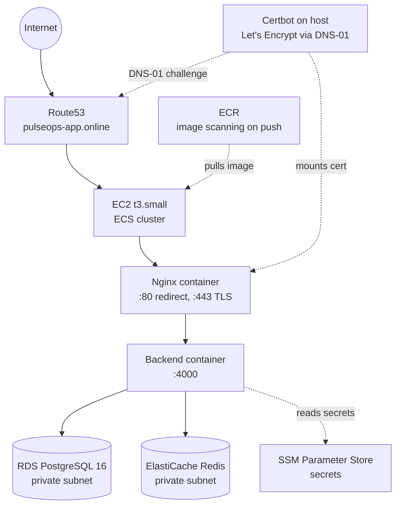

# PulseOps Infrastructure

The AWS infrastructure behind [PulseOps](https://github.com/elizabeth-ikechukwu/pulseops), provisioned entirely with Terraform and deployed through GitHub Actions.

**Live:** [pulseops-app.online](https://pulseops-app.online)

## Results

- 6 AWS services provisioned as code and running in production: VPC, RDS, ElastiCache, ECR, ECS, Route53
- Zero static AWS credentials anywhere. Every pipeline authenticates through OIDC with its own purpose-built IAM role
- IAM permissions built to least privilege one action at a time against real, logged errors, not granted broadly upfront. Four separate AWS service-linked role dependencies (RDS, ElastiCache, Auto Scaling, ECS) diagnosed and resolved individually
- Diagnosed and fixed a real deployment conflict where Terraform and the CI/CD pipeline were both trying to control which application version was live. Left unfixed, a routine infrastructure change would have silently rolled back a working deployment
- Diagnosed a non-obvious architecture fact mid-build, that Nginx runs inside the frontend container rather than on the host, then engineered around it: certbot on the EC2 host proves domain ownership through a Route53 DNS-01 challenge instead of the usual HTTP-01 challenge, since port 80 was already held by the container
- Added a narrowly scoped IAM permission for the DNS-01 challenge, then verified it worked by testing from the instance role itself inside a live session, not by trusting what Terraform state claimed
- CI/CD tags every image with the exact git commit SHA and registers a fresh ECS task definition revision on every deploy, so the running code is always traceable back to an exact commit

## Architecture



## Decisions and tradeoffs

**No NAT Gateway, no Application Load Balancer.** The EC2 instance sits in a public subnet with its own Elastic IP instead. Real production architecture puts compute in a private subnet behind a NAT Gateway and an ALB, this deployment skips both to keep a personal, single-instance project close to free-tier cost. RDS and ElastiCache stay in private subnets regardless, they never needed outbound internet access either way.

**ECS on EC2, not Fargate, not EKS.** EC2 launch type avoids EKS's flat control-plane fee and stays within AWS free-tier instance types. Kubernetes would be the standard answer at real scale; a single-instance deployment doesn't justify that operational overhead.

**Two separate IAM roles, not one.** `pulseops-github-deploy` handles Terraform changes: VPC, IAM, database, full infrastructure. `pulseops-app-deploy` is deliberately narrower: it can push to two specific ECR repositories and update one specific ECS service, nothing else. A compromised app pipeline can't touch the network or the database.

**Terraform and the CI/CD pipeline both write to the same ECS task definition.** Terraform manages infrastructure settings (CPU, memory, secrets, environment variables). The pipeline manages which revision is actually deployed. Without `lifecycle { ignore_changes = [task_definition] }` on the service, a routine `terraform apply` would silently redeploy an older revision, undoing a live deploy. This was caught in a real `terraform plan` before it happened.

**Certbot instead of ACM.** ACM only issues certificates for resources it can attach to, like an ALB or CloudFront. This deployment has neither, so certbot on the host proves domain ownership through Route53 instead. The trade-off: renewal isn't automatic the way ACM's is, the certificate has to be re-mounted into the container on each deploy rather than rotating behind a load balancer.

## Stack

Terraform, AWS (VPC, EC2, ECS, RDS, ElastiCache, ECR, Route53, IAM, SSM, S3), GitHub Actions, OIDC, Certbot, Let's Encrypt.

## Repo structure

```
modules/
├── vpc/ VPC, public and private subnets across 2 AZs, no NAT
├── rds/ PostgreSQL, private subnet, password generated and stored in SSM
├── elasticache/ Redis, private subnet
├── ecr/ Two repositories, scan-on-push, 10-image retention
├── ecs/ Cluster, EC2 capacity provider, auto scaling group
├── ecs-service/ Task definition, both containers, execution and task IAM roles
└── dns/ Route53 hosted zone and A records

environments/dev/ Root config wiring every module together for this environment
bootstrap/ One-time OIDC and IAM setup, run once by hand before any pipeline exists
.github/workflows/ terraform.yml: plans on PR, applies on merge to main
```

## Deploy pipeline

Two independent pipelines, each scoped to what it actually needs to do:

**Infrastructure** (`terraform.yml`, this repo): plans on every pull request, applies on merge to `main`.

**Application** (`deploy.yml`, [pulseops](https://github.com/elizabeth-ikechukwu/pulseops) repo): builds both containers, tags with the commit SHA, pushes to ECR, registers a new task definition revision, deploys it, and waits for the service to report stable before finishing.

## Bootstrapping this from zero

OIDC trust between GitHub and AWS, and the S3 bucket holding Terraform state, both have to exist before any pipeline can run. That's a one-time manual step by design, every real company does this exact bootstrap once, by hand. Steps and reasoning are in `bootstrap/`.
